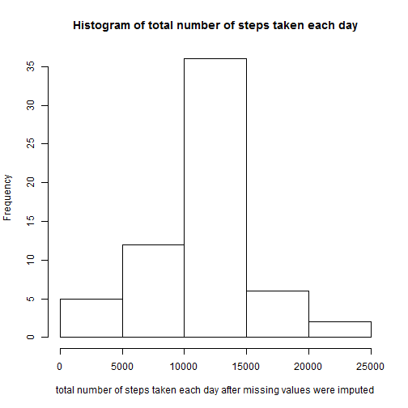
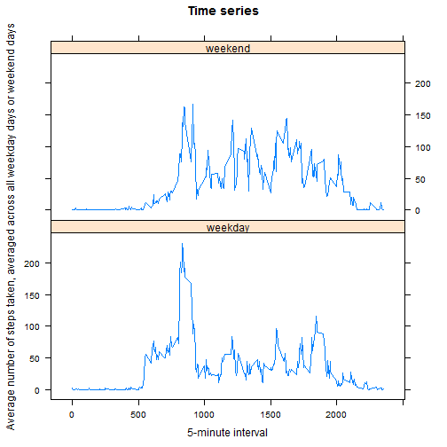

```r
#setwd("~")

#read Activity data
act <- read.csv("Activity.csv", header = TRUE, na.strings = "NA", colClasses = c("numeric", "character", "numeric"))
```


What is the mean total number of steps taken per day?


```r
#install package to use the function 'ddply'
install.packages("plyr", repos="http://cran.rstudio.com/")
```

```
## Installing package into 'C:/Users/CyperPrime/Documents/R/win-library/3.2'
## (as 'lib' is unspecified)
```

```
## package 'plyr' successfully unpacked and MD5 sums checked
## 
## The downloaded binary packages are in
## 	C:\Users\CyperPrime\AppData\Local\Temp\Rtmpam4CUJ\downloaded_packages
```

```r
library(plyr)

##1)total number of steps taken per day
act_sum <- ddply(act, .(date), summarize, tot = sum(steps))

#coerce to numeric
act_sum_n <- as.numeric(act_sum[,2])

##2)the histogram
hist(act_sum_n, main = paste("Histogram of total number of steps taken each day"), xlab = "total number of steps taken each day")
```

 

```r
##3)the mean and median
act_mean <- mean(act_sum_n, na.rm = TRUE)
act_median <- median(act_sum_n, na.rm = TRUE)
```

The mean is:

```r
print(act_mean)
```

```
## [1] 10766.19
```

The median is:

```r
print(act_median)
```

```
## [1] 10765
```


What is the average daily activity pattern?


```r
#average steps based on interval
act_mean_daily <- ddply(act, .(interval), summarize, avg = mean(steps, na.rm = TRUE))

#coerce to numeric
interval <- as.numeric(act_mean_daily[,1])
avg <- as.numeric(act_mean_daily[,2])

##1)time-series plot
plot(interval, avg, type = "l", main = "Time series", xlab = "5-minute interval", ylab = "Average number of steps taken")
```

 

```r
##2)max steps
avg_max <- max(avg)
interval_ofMax <- act_mean_daily[act_mean_daily[,2] == avg_max, ]
```

The 5-minute interval, on average across all the days in the dataset, that contains the maximum number of steps is:

```r
print(interval_ofMax[,1])
```

```
## [1] 835
```


Inputting missing values


```r
##1)find total number of missing values
na_sum <- sum(is.na(act[,1]))
```

The total number of missing values in the dataset is:

```r
print(na_sum)
```

```
## [1] 2304
```


```r
##2)replace missing values by mean (of intervals over days)
act_comp <- data.frame(steps = act[,1], dates = act[,2], interval = act[,3])

for(i in 1:length(act[,1])){
  if(is.na(act[i,1])){
    act_comp[i,1] <- act_mean_daily[act[i,3] == act_mean_daily[,1], 2]
  }#end of if
}#end of for
```

The strategy for filling in all of the missing values in the dataset is by using the mean of intervals over days values

3)new data set name: act_com


```r
#sum of steps based on dates
act_comp_sum <- ddply(act_comp, .(dates), summarize, tot = sum(steps))

#coerce to numeric
act_comp_sum_n <- as.numeric(act_comp_sum[,2])

##4)the histogram, mean, and median
hist(act_comp_sum_n, main = paste("Histogram of total number of steps taken each day"), xlab = "total number of steps taken each day after missing values were imputed")
```

 

```r
act_comp_mean <- mean(act_comp_sum_n, na.rm = TRUE)
act_comp_median <- median(act_comp_sum_n, na.rm = TRUE)
```

The mean is:

```r
print(act_comp_mean)
```

```
## [1] 10766.19
```

The median is:

```r
print(act_comp_median)
```

```
## [1] 10766.19
```

Do these values differ from the estimates from the first part of the assignment?
Yes 

What is the impact of inputting missing data on the estimates of the total daily number of steps?
The median is more centered to the mean now


Are there differences in activity patterns between weekdays and weekends?


```r
#change dates to days
act_days <- act_comp
act_days[,2] <- weekdays(as.Date(act_days[,2]))

#separate to weekdays and weekends
loop <- nrow(act_days)
index <- vector("numeric", length = loop)

for(j in 1:loop){
  if(act_days[j,2] == "Monday" |
     act_days[j,2] == "Tuesday" |
     act_days[j,2] == "Wednesday" |
     act_days[j,2] == "Thursday" |
     act_days[j,2] == "Friday"){
  index[j] <- 0
  }# end if
  else if(act_days[j,2] == "Saturday" |
          act_days[j,2] == "Sunday"){
       index[j] <- 1
       }#end else if
}#end for

##1)coerce to factor
day_index <- factor(index, labels = c("weekday", "weekend"))
```

'day_index' will determine which days are 'weekday's or 'weekend's


```r
#install package to use the function 'xyplot'
install.packages("lattice", repos="http://cran.rstudio.com/")
```

```
## Installing package into 'C:/Users/CyperPrime/Documents/R/win-library/3.2'
## (as 'lib' is unspecified)
```

```
## package 'lattice' successfully unpacked and MD5 sums checked
## 
## The downloaded binary packages are in
## 	C:\Users\CyperPrime\AppData\Local\Temp\Rtmpam4CUJ\downloaded_packages
```

```r
library(lattice)

#append week type to the complete data set
act_comp[,4] <- day_index

#average steps based on interval and week types
act_comp_mean_daily <- ddply(act_comp, .(interval, V4), summarize, avg = mean(steps, na.rm = TRUE))

##2)the xyplot
xyplot(avg ~ interval | V4, data = act_comp_mean_daily, layout = c(1,2), type = "l", main = "Time series", xlab = "5-minute interval", ylab = "Average number of steps taken, averaged across all weekday days or weekend days")
```

 

There is a clear difference (visually) in activity patterns between weekday days and weekend days
